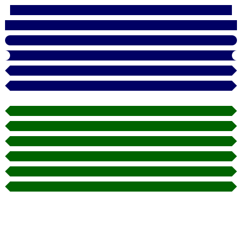
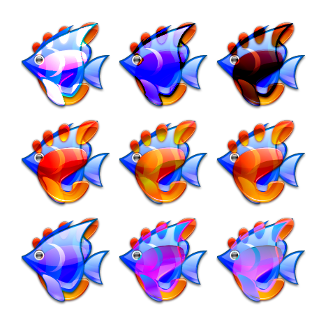

## Rebol/Blend2D `draw` dialect code examples

Using following assets:
```rebol
texture: load %assets/texture.jpeg
plan:  premultiply load %assets/Plan31.png
fish:  premultiply load %assets/fish.png
gnome: premultiply load %assets/gnome.png
text: "The quick brown fox jumps over the lazy dog. 123456780"

grid10x10: draw 20x20 [fill 215.215.215 box 0x0 10x10 box 10x10 20x20]

```
* * * *


### Text 01
```rebol
draw 480x480 [
    font %assets/NotoSans-Regular.ttf
    text 1x12  12 :text
    text 1x40  18 :text
    text 1x74  24 :text
    text 1x120 36 :text
    text 1x178 48 :text
    text 1x248 60 :text
    text 1x330 72 :text
    fill red
    text 1x444 104 :text
]
```


### Fill texture
```rebol
draw 480x480 [
    fill :texture
    circle 240x240 200
]
```


### Fill radial
```rebol
draw 480x480 [
    fill radial 255.255.255 0 95.175.223 0.5 47.95.223 1 240x240 120x120 215
    circle 240x240 200
]
```


### Fill linear
```rebol
draw 480x480 [
    fill linear 255.255.255 0 95.175.223 0.5 47.95.223 1 0x480 0x0
    fill-all
]
```


### Fill conical
```rebol
draw 480x480 [
    fill conical 255.255.255 0 95.175.223 0.5 255.255.255 1 240x240 0x240
    fill-all
]
```


### Clear
```rebol
draw 480x480 [
    fill :texture
    fill-all
    clear 100x100 380x380
]
```


### Clip
```rebol
draw 480x480 [
    line-width 10 pen black
    fill :grid10x10	fill-all
    clip 100x100 380x380
    fill :texture
    fill-all
    alpha 50%
    line 0x0 480x480
    clip off
    line 0x480 480x0
]
```


### Line join
```rebol
draw 480x480 [
    line-width 20 pen gray
    line-join miter       line 140x20   40x80  140x80
    line-join round       line 300x20  200x80  300x80
    line-join bevel       line 460x20  360x80  460x80

    line-join miter       line 140x120  40x180 140x180
    line-join miter       line 300x140 200x180 300x180
    line-join miter       line 460x150 360x180 460x180

    line-join miter round line 140x220  40x280 140x280
    line-join miter round line 300x240 200x280 300x280
    line-join miter round line 460x250 360x280 460x280

    line-join miter bevel line 140x320  40x380 140x380
    line-join miter bevel line 300x340 200x380 300x380
    line-join miter bevel line 460x350 360x380 460x380
    
    line-join miter
    line-width 1 pen black
    line 140x20   40x80 140x80
    line 300x20  200x80 300x80
    line 460x20  360x80 460x80

    line 140x120  40x180 140x180
    line 300x140 200x180 300x180
    line 460x150 360x180 460x180

    line 140x220  40x280 140x280
    line 300x240 200x280 300x280
    line 460x250 360x280 460x280

    line 140x320  40x380 140x380
    line 300x340 200x380 300x380
    line 460x350 360x380 460x380 
]
```


### Line cap
```rebol
draw 480x480 [
    pen 0.0.100
    line-width 20
    line-cap 0 line 20x20 460x20
    line-cap 1 line 20x50 460x50
    line-cap 2 line 20x80 460x80
    line-cap 3 line 20x110 460x110
    line-cap 4 line 20x140 460x140
    line-cap 5 line 20x170 460x170

    pen 0.100.0
    line-cap 5 0 line 20x220 460x220
    line-cap 5 1 line 20x250 460x250
    line-cap 5 2 line 20x280 460x280
    line-cap 5 3 line 20x310 460x310
    line-cap 5 4 line 20x340 460x340
    line-cap 5 5 line 20x370 460x370
]
```



### Line width
```rebol
draw 480x480 [
    pen 0.0.0
    line-width 1  line 10x0   470x0
    line-width 3  line 10x40  470x40
    line-width 5  line 10x80  470x80
    line-width 7  line 10x120 470x120
    line-width 9  line 10x160 470x160
    line-width 11 line 10x200 470x200
    line-width 13 line 10x240 470x240
    line-width 15 line 10x280 470x280
    line-width 17 line 10x320 470x320
    line-width 19 line 10x360 470x360
    line-width 21 line 10x400 470x400
    line-width 23 line 10x440 470x440
    line-width 25 line 10x480 470x480
]
```


### Polygon
```rebol
draw 480x480 [
    pen 200.60.60 line-width 4
    fill 200.200.200.100
    polygon 10x10 470x10 470x470 10x470 
    fill off
    polygon 10x10 240x100 470x10 380x240 470x470 240x380 10x470 100x240
    fill 255.0.0 
    polygon 10x10 240x200 470x10 280x240 470x470 240x280 10x470 200x240
]
```


### Polygon translate join
```rebol
draw 480x480 [
    pen red fill-pen orange
    line-width 10 line-join round
    translate 10x0
    polygon 50x100 50x200 150x100 150x200
    translate 130x0 line-join miter
    polygon 50x100 50x200 150x100 150x200
    translate 130x0 line-join bevel
    polygon 50x100 50x200 150x100 150x200
]
```


### Polygon translate
```rebol
draw 480x480 [
    line-width 3
    pen red
    reset-matrix
    scale 1.5
    translate 100x100
    polygon 50x5 62x40 95x40 68x60 80x95 50x74 20x95 32x60 5x40 38x40

    reset-matrix        
    translate 100x100
    polygon 50x5 62x40 95x40 68x60 80x95 50x74 20x95 32x60 5x40 38x40

    reset-matrix
    scale .5
    translate 100x100
    polygon 50x5 62x40 95x40 68x60 80x95 50x74 20x95 32x60 5x40 38x40

    reset-matrix
    scale .2
    translate 100x100
    polygon 50x5 62x40 95x40 68x60 80x95 50x74 20x95 32x60 5x40 38x40

    reset-matrix
    pen blue
    polygon 50x5 62x40 95x40 68x60 80x95 50x74 20x95 32x60 5x40 38x40
]
```


### Image alpha
```rebol
draw 480x480 [
    alpha 30%
    image :texture 0x0
    alpha 100%
    image :texture 40x40 400x400
]
```


### Image scale rotate
```rebol
draw 480x480 [
                        image :plan 00x100
    scale 0.8 rotate 10 image :plan 50x100
    scale 0.8 rotate 10 image :plan 50x100
    scale 0.8 rotate 10 image :plan 50x100
    scale 0.8 rotate 10 image :plan 50x100
]
```


### Image blend 1
```rebol
draw 480x480 [
    clear-all
    scale 0.5
    translate 30x30
    blend 'source-copy      image :fish  0x0
    blend 'source-over      image :gnome 0x0
    translate 140x0
    blend 'source-copy      image :fish  0x0
    blend 'source-copy      image :gnome 0x0
    translate 140x0
    blend 'source-copy      image :fish  0x0
    blend 'source-in        image :gnome 0x0

    translate -280x140
    blend 'source-copy      image :fish  0x0
    blend 'source-out       image :gnome 0x0
    translate 140x0
    blend 'source-copy      image :fish  0x0
    blend 'source-atop      image :gnome 0x0
    translate 140x0
    blend 'source-copy      image :fish  0x0
    blend 'destination-over image :gnome 0x0

    translate -280x140
    blend 'source-copy      image :fish  0x0
    blend 'destination-in   image :gnome 0x0
    translate 140x0
    blend 'source-copy      image :fish  0x0
    blend 'destination-out  image :gnome 0x0
    translate 140x0
    blend 'source-copy      image :fish  0x0
    blend 'destination-atop image :gnome 0x0
]
```


### Image blend 2
```rebol
draw 480x480 [
    clear-all
    scale 0.5
    translate 30x30
    blend 'source-copy      image :fish  0x0
    blend 'xor              image :gnome 0x0
    translate 140x0
    blend 'source-copy      image :fish  0x0
    blend 'plus            image :gnome 0x0
    translate 140x0
    blend 'source-copy      image :fish  0x0
    blend 'minus             image :gnome 0x0

    translate -280x140
    blend 'source-copy      image :fish  0x0
    blend 'modulate         image :gnome 0x0
    translate 140x0
    blend 'source-copy      image :fish  0x0
    blend 'multiply         image :gnome 0x0
    translate 140x0
    blend 'source-copy      image :fish  0x0
    blend 'screen           image :gnome 0x0

    translate -280x140
    blend 'source-copy      image :fish  0x0
    blend 'overlay          image :gnome 0x0
    translate 140x0
    blend 'source-copy      image :fish  0x0
    blend 'darken           image :gnome 0x0
    translate 140x0
    blend 'source-copy      image :fish  0x0
    blend 'lighten          image :gnome 0x0
]
```


### Image blend 3
```rebol
draw 480x480 [
    clear-all
    scale 0.5
    translate 30x30
    blend 'source-copy      image :fish  0x0
    blend 'color-dodge      image :gnome 0x0
    translate 140x0
    blend 'source-copy      image :fish  0x0
    blend 'color-burn       image :gnome 0x0
    translate 140x0
    blend 'source-copy      image :fish  0x0
    blend 'linear-burn      image :gnome 0x0

    translate -280x140
    blend 'source-copy      image :fish  0x0
    blend 'linear-light     image :gnome 0x0
    translate 140x0
    blend 'source-copy      image :fish  0x0
    blend 'pin-light        image :gnome 0x0
    translate 140x0
    blend 'source-copy      image :fish  0x0
    blend 'hard-light       image :gnome 0x0

    translate -280x140
    blend 'source-copy      image :fish  0x0
    blend 'soft-light       image :gnome 0x0
    translate 140x0
    blend 'source-copy      image :fish  0x0
    blend 'difference       image :gnome 0x0
    translate 140x0
    blend 'source-copy      image :fish  0x0
    blend 'exclusion        image :gnome 0x0
]
```



### Box rotate
```rebol
draw 480x480 [
    fill 200.0.0.100 pen 0.0.0.100 line-width 10
    box 20x20 440x440
    rotate 45 240x240
    box 20x20 440x440
    reset-matrix
    box 100x100 280x280
]
```


### Ellipse
```rebol
draw 480x480 [
    line-width 4
    pen 200.60.60 
    ellipse 10x10  460x460
    ellipse 10x100 460x280
    ellipse 10x200 460x80
    pen 60.60.200 
    ellipse 100x10 280x460
    ellipse 200x10 80x460
]
```


### Arc
```rebol
draw 480x480 [
    line-width 4
    pen 200.60.60 
    arc 240x240 100x100 0 240 pie
    line-width 6
    arc 240x240 150x150 0 240
    line-width 8 
    arc 240x240 200x200 0 240 chord
]
```


### Cubic
```rebol
draw 480x480 [
    pen 200.60.60 line-width 4
    cubic 10x470 100x10 380x470 470x10 
    pen 60.60.200 line-width 4.0
    cubic 470x10 10x100 470x380 10x470
]
```


### Shape 1
```rebol
draw 480x480 [
    fill :grid10x10	fill-all
    pen 200.60.60 line-width 10
    shape [
    	move 100x300 arc  380x300 100 150 0 close
    	move 100x330 line 380x330
    ]
]
```


### Shape 2
```rebol
; preprocessed shape path
my-shape: b2d/path [
    move 100x300 arc  380x300 100 150 0 close
    move 100x330 line 380x330
]
```
```rebol
== #[handle! BLPath]
```

```rebol
draw 480x480 [
    fill :grid10x10	fill-all
    fill 10.10.10.100
    pen 200.60.60 line-width 10
    shape :my-shape
    pen 60.60.200 line-width 5 translate 0x50
    shape :my-shape
]
```


* * * *
This file was generated using [examples.r3](examples.r3) script.
